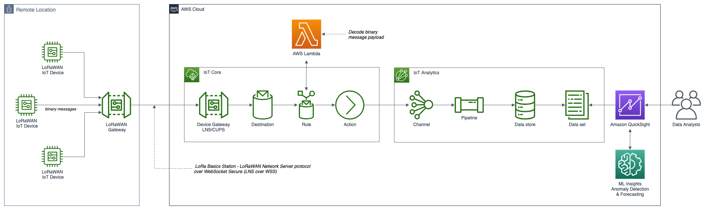

# AWS IoT Core for LoRaWAN, Amazon IoT Analytics, and Amazon QuickSight Demonstration

Source code for the post, [AWS IoT Core for LoRaWAN, Amazon IoT Analytics, and Amazon QuickSight](https://garystafford.medium.com/).

## Lambda Binary Decoder Function

The source code for AWS Lambda function used to decode the device's binary messages originated from the following AWS GitHub project: [github.com/aws-samples/aws-iot-core-lorawan](https://github.com/aws-samples/aws-iot-core-lorawan/).

## Architecture

The architecture of this post's demonstration.

